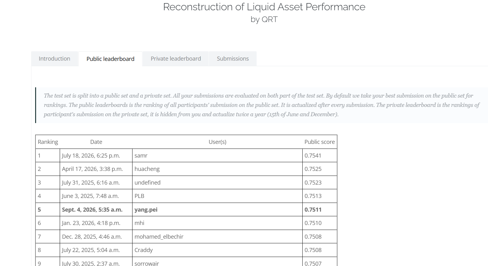

# Result provenance

## Competition result

| Field | Current record |
| --- | --- |
| Competition | Reconstruction of Liquid Asset Performance, QRT / ENS ChallengeData #44; [public challenge page](https://challengedata.ens.fr/challenges/44) |
| Public leaderboard position | 5, visible in the supplied screenshot |
| Displayed public score | 0.7511, at the precision displayed by the platform |
| Evidence status | Original author-provided screenshot, visually checked and included below; not an independent live platform lookup |
| Screenshot capture timestamp | Not recorded in the image; do not infer it from the leaderboard's Date column |
| Entry's displayed Date field | Sept. 4, 2026, 5:35 a.m.; no timezone is shown |
| Finality | Public-board snapshot only; not a final or private-board result |
| Leaderboard type | Public leaderboard, visibly selected in the screenshot |
| Total field size | 484, reported by the author but not shown in this screenshot; the platform's counting unit is not established by the image |
| Display name | `yang.pei`, visible in the ranking row |

## Screenshot evidence

The supplied PNG is reproduced unchanged. Its SHA-256 is `57678e19c522fcbbfed92348c5278c8c6ddd4646426e898fe83f3de1d3495743`. The release checker accepts only this reviewed image digest. The image contains no private feature construction, prediction arrays, account email, or access tokens. Inspection found only image/size-related PNG chunks, with no embedded textual metadata.

The public challenge page confirms the task and metric, but does not show the ranking entry in the retrieved public view. The image supports what was visible in that supplied screenshot; it does not establish a current live rank, capture time, or final result.

To support the full expression "5/484", add separate evidence of the total field size and clarify whether it counts entries, participants, or teams. A capture timestamp can be added if the author can confirm it. Until then the principal project claim is rank 5 on the public leaderboard, score 0.7511.

## What the repository verifies

The tests and demo verify the public implementation's behavior on synthetic inputs. They do not authenticate the live leaderboard, establish competition eligibility, or validate generalization of the hidden feature pipeline. Synthetic results generated by running the notebooks are separate from the screenshot-supported result above.

The [competition case study](COMPETITION_CASE_STUDY.md) provides checked aggregate OOF results, ensemble weights, and paired error diagnostics for a consistent local snapshot. These are not independent benchmarks: historical OOF labels were used for model and ensemble selection. The exact platform-upload link between that snapshot and the reported online score has not been established.

## Suggested CV wording

> QRT / ENS ChallengeData - Reconstruction of Liquid Asset Performance. Achieved public leaderboard rank 5 (score: 0.7511; handle: yang.pei). Developed a two-stage Ridge, LightGBM, and ExtraTrees ensemble with grouped OOF validation, hyperparameter search, and stability-aware blending. Public research code and synthetic-data demonstration; proprietary feature construction withheld.

Link the project title to the published repository and the placement to the screenshot evidence. Add a dated "as of" qualifier only when the capture date is confirmed. Add the denominator after its supporting evidence is available.
